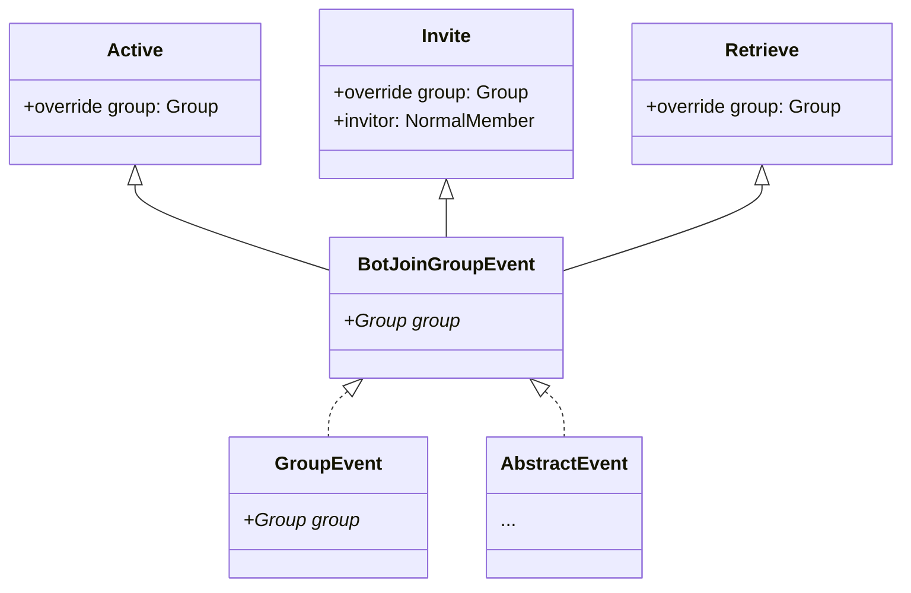

# ListenerConfig

事件监听器相关的配置说明

---

## 默认示例

```yaml
- type: MemberJoinEvent
  objectBotId: 0
  filter: true
  provideEventAllValue: true
  priority: NORMAL
  readSubclassObjectName:
    - all
  parentScope: PLUGIN_SCOPE
  isListenOnce: false
  run:
    - use: MESSAGE_MANAGER
      call: sendMessageToGroup
      args:
        - '%call-group%'
        - 欢迎新人！
      name: only_run
```

以上默认配置实现了新人入群自动欢迎的功能

## 描述

本配置存储着一个`List`对象，`List`中的每一项都会被反序列化为一个监听器对象

这些监听器在**加载插件**的过程中**就会被启动**
因此你可以监听到自**成功加载配置后的所有事件**

在加载过程中，会输出以下日志(日志等级`DEBUG,VERBOSE`)

```text
D/YamlBot: [startAllListener] Try to start all listeners...
V/YamlBot: [startAllListener] Start listener --> Type#0
V/YamlBot: [startAllListener] Start listener --> Type#1
V/YamlBot: [startAllListener] Start listener --> ...
D/YamlBot: [startAllListener] Done.
```

当输出`Done.`时，则代表所有事件监听器均已开启

## 参数说明

每一个`EventListener`事件监听器参数的说明

### Type

监听事件类型，不包括子类名称

可监听的事件类型几乎支持了`mirai`可监听的[事件](https://docs.mirai.mamoe.net/EventList.html)

值得注意的是，如果需要监听的事件属于某种事件的分支，则添加它的父类，并在`readSubclassObjectAllName`中声明

举个例子，有以下事件类



若要监听其中的`Invite`类，应该使用`BotJoinGroupEvent`而不是`Invite`作为`type`关键词

以监听`Invite`类为例，你应该编写以下代码

```yaml
- type: 'BotJoinGroupEvent'
  readSubclassObjectName: [ 'Invite' ]
```

同样的，你还可以监听多个子类

```yaml
- type: 'BotJoinGroupEvent'
  readSubclassObjectName: [ 'Invite','Active' ]
```

这样就会同时监听`Invite`,`Active`两个子类

### Filter

事件的过滤器，当满足后才会执行操作 **默认为`true`**

此处需要一段表达式，内容与运算符之间需要用空格隔离

例如：

- `a == b` 可被识别
- `a==b` 不可被识别
- `! true` 可被识别
- `!true` 无法被识别

支持的运算符

- `!` 反转条件 (`not`)
- `==` 等于 (`equals`)
- `!=` 不等于
- `||` 或者(`or`)
- `&&` 并且(`and`)
- `is` 属于
  - 右值为字符串时，检测名称是否相同
  - 反之，比较二者的`class`对象

由于支持的内容较少，`YamlBot`在**此处允许**你使用`js`表达式提供

使用 `%js:表达式%` 转换 

运行时，会将表达式转换为以下`js`代码

```JavaScript
function callByEvaluate_TempFunction() {
    return $expression;
}
```

调用`callByEvaluate_TempFunction`函数，并比较`toString()`是否为`"true"`

举个例子：

```text
true && %js:true% || %js:false% == "false"
```

就会返回`true`

### ObjectBotId

该项适用于对多账号运行的使用 **默认为0**

过滤事件，要求监听到事件的`Bot` `qq`号，需要一个`Long/Int`作为`qq`号识别

当监听到的事件的`Bot` `qq`号与所设定的内容相同时才会执行操作

运行时，此处等同与在`filter`过滤中添加条件`%call-botid% == $objectBotId`

### ProvideEventAllValue

是否向存储的模板添加事件内有的值  **默认为`true`**

**注意：当此处设置为`false`时，`objectBotId`会失效！**

### Priority

监听器的优先级 **默认为`NORMAL`**

 在广播时, 事件监听器的调用顺序为 (从左到右):
 `HIGHEST > HIGH > NORMAL > LOW > LOWEST > MONITOR`

 - 使用 `MONITOR` 优先级的监听器将会被**并行**调用.
 - 使用 `MONITOR` 优先级的监听器**无法**拦截事件.
 - 使用其他优先级的监听器都将会**按顺序**调用.
   因此一个监听器的挂起可以阻塞事件处理过程而导致低优先级的监听器较晚处理.

 当事件被拦截后, 优先级较低 (靠右) 的监听器将不会被调用.
 
### ReadSubclassObjectName

指定读取的子类 **默认为`[all]`**

- 当内容为`all`时，监听其所有子类
- 当无法查找内容指定子类时，抛出错误`NotImplementedError`
- 当`type`不支持时，忽略此设置

### ParentScope

监听事情基于的`Scope`，`Scope`影响着监听器的生命周期 **默认为`PLUGIN_SCOPE`**

支持的`Scope`

[//]: # (PLUGIN_JOB | NEW_JOB_FROM_PLUGIN | USE_EITHER_JOB$Name$)

- `PLUGIN_SCOPE` 插件所默认的`Scope`
- `NEW_SCOPE_FROM_PLUGIN` 以插件默认的`Scope`新建一个`Scope`，新的`Scope`的生命周期与插件`Scope`生命周期相同（**仅存在一个**）
- `USE_EITHER_JOB$Name$` 使用一个新建的`Scope`，每一个指令都会创造一个对应的`Scope`
   较为特别的是，你可以设定新的名称。<br>
   举个例子，使用`USE_EITHER_JOB$MyScope1$` 就会新建一个名称为`MyScope1`的`Scope`

### IsListenOnce

是否只监听一次 **默认为`false`**

由于此设置仅会监听一次，所有其**只会在第一次监听**到事件时会运行

之后并不会再次执行操作

### Run

当事件触发时会进行的操作

此处与`Command`的`run`属性大体相同

唯一不同的是，此处用在[CommandReg](CommandReg.md)中不存在的新的`use`属性

你可以使用`EVENT`来调用这个事件特有的函数。

举个例子，若要拦截所监听的事件可用以下`run`配置

```yaml
use: EVENT
call: intercept
args: [] # 无需参数
name: any
```

以上配置即可拦截事件