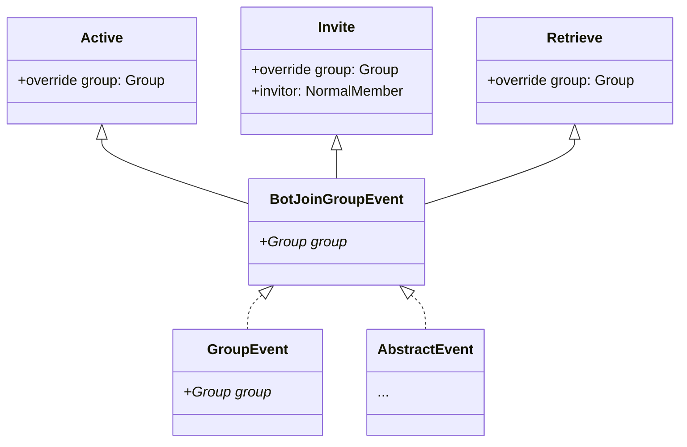

# ListenerConfig

事件监听器相关的配置说明

---

## 默认示例

```yaml
- type: MemberJoinEvent
  objectBotId: 0
  filter: true
  provideEventAllValue: true
  priority: NORMAL
  readSubclassObjectName:
    - all
  parentScope: PLUGIN_SCOPE
  isListenOnce: false
  run:
    - use: MESSAGE_MANAGER
      call: sendMessageToGroup
      args:
        - '%call-group%'
        - 欢迎新人！
      name: only_run
```

以上默认配置实现了新人入群自动欢迎的功能

## 描述

本配置存储着一个`List`对象，`List`中的每一项都会被解析为一个监听器

这些监听器在**加载插件**的过程中**就会被启动**
因此你可以监听到自**成功加载配置后的所有事件**

在加载过程中，会输出以下日志(日志等级`DEBUG,VERBOSE`)

```text
D/YamlBot: [startAllListener] Try to start all listeners...
V/YamlBot: [startAllListener] Start listener --> Type#0
V/YamlBot: [startAllListener] Start listener --> Type#1
V/YamlBot: [startAllListener] Start listener --> ...
D/YamlBot: [startAllListener] Done.
```

当输出`Done.`时，则代表所有事件监听器均已开启

## 参数说明

每一个`EventListener`事件监听器参数的说明

### Type

监听事件类型，不包括子类名称

可监听的事件类型几乎支持了`mirai`可监听的[事件](https://docs.mirai.mamoe.net/EventList.html)

值得注意的是，如果需要监听的事件属于某种事件的分支，则添加它的父类，并在`readSubclassObjectAllName`中声明

举个例子，有以下事件类



若要监听其中的`Invite`类，应该使用`BotJoinGroupEvent`而不是`Invite`作为`type`关键词

以监听`Invite`类为例，你应该编写以下代码

```yaml
- type: 'BotJoinGroupEvent'
  readSubclassObjectName: [ 'Invite' ]
```

同样的，你还可以监听多个子类

```yaml
- type: 'BotJoinGroupEvent'
  readSubclassObjectName: [ 'Invite','Active' ]
```

这样就会同时监听`Invite`,`Active`两个子类

### Filter

事件的过滤器，当满足后才会执行操作 **默认为`true`**

此处需要一段表达式，内容与运算符之间需要用空格隔离

例如：

- `a == b` 可被识别
- `a==b` 不可被识别
- `! true` 可被识别
- `!true` 无法被识别

支持的运算符

- `!` 反转条件 (`not`)
- `==` 等于 (`equals`)
- `!=` 不等于
- `||` 或者(`or`)
- `&&` 并且(`and`)
- `is` 属于
    - 右值为字符串时，检测名称是否相同
    - 反之，比较二者的`class`对象

由于支持的内容较少，`YamlBot`在**此处允许**你使用`js`表达式提供

使用 `%js:表达式%` 转换

运行时，会将表达式转换为以下`js`代码

```JavaScript
function callByEvaluate_TempFunction() {
    return $expression;
}
```

调用`callByEvaluate_TempFunction`函数，并比较`toString()`是否为`"true"`

举个例子：

```text
true && %js:true% || %js:false% == "false"
```

就会返回`true`

### ObjectBotId

该项适用于对多账号运行的使用 **默认为0**

过滤事件，要求监听到事件的`Bot` `qq`号，需要一个`Long/Int`作为`qq`号识别

当监听到的事件的`Bot` `qq`号与所设定的内容相同时才会执行操作

运行时，此处等同与在`filter`过滤中添加条件`%call-botid% == $objectBotId`

### ProvideEventAllValue

是否向存储的模板添加事件内有的值  **默认为`true`**

**注意：当此处设置为`false`时，`objectBotId`会失效！**

### Priority

监听器的优先级 **默认为`NORMAL`**

在广播时, 事件监听器的调用顺序为 (从左到右):
`HIGHEST > HIGH > NORMAL > LOW > LOWEST > MONITOR`

- 使用 `MONITOR` 优先级的监听器将会被**并行**调用.
- 使用 `MONITOR` 优先级的监听器**无法**拦截事件.
- 使用其他优先级的监听器都将会**按顺序**调用.
  因此一个监听器的挂起可以阻塞事件处理过程而导致低优先级的监听器较晚处理.

当事件被拦截后, 优先级较低 (靠右) 的监听器将不会被调用.

### ReadSubclassObjectName

指定读取的子类 **默认为`[all]`**

- 当内容为`all`时，监听其所有子类
- 当无法查找内容指定子类时，抛出错误`NotImplementedError`
- 当`type`不支持时，忽略此设置

### ParentScope

监听事情基于的`Scope`，`Scope`影响着监听器的生命周期 **默认为`PLUGIN_SCOPE`**

支持的`Scope`

[//]: # (PLUGIN_JOB | NEW_JOB_FROM_PLUGIN | USE_EITHER_JOB$Name$)

- `PLUGIN_SCOPE` 插件所默认的`Scope`
- `NEW_SCOPE_FROM_PLUGIN` 以插件默认的`Scope`新建一个`Scope`，新的`Scope`的生命周期与插件`Scope`生命周期相同（**仅存在一个**）
- `USE_EITHER_JOB$Name$` 使用一个新建的`Scope`，每一个指令都会创造一个对应的`Scope`
  较为特别的是，你可以设定新的名称。<br>
  举个例子，使用`USE_EITHER_JOB$MyScope1$` 就会新建一个名称为`MyScope1`的`Scope`

### IsListenOnce

是否只监听一次 **默认为`false`**

由于此设置仅会监听一次，所有其**只会在第一次监听**到事件时会运行

之后并不会再次执行操作

### Run

当事件触发时会进行的操作

此处与`Command`的`run`属性大体相同

唯一不同的是，此处用在[CommandReg](CommandReg.md)中不存在的新的`use`属性

你可以使用`EVENT`来调用这个事件特有的函数。

举个例子，若要拦截所监听的事件可用以下`run`配置

```yaml
use: EVENT
call: intercept
args: [ ] # 无需参数
name: any
```

以上配置即可拦截事件

### 支持的事件

#### 基本事件

| 事件名称                                   | 内置函数及功能说明                                                                                             | 内部支持占位符                                                                                                                                                                                                                               | 说明                                                                                           |
|:---------------------------------------|:------------------------------------------------------------------------------------------------------|:--------------------------------------------------------------------------------------------------------------------------------------------------------------------------------------------------------------------------------------|:---------------------------------------------------------------------------------------------|
| __顶层事件__                               | `intercept` <br/> > 拦截这个事件                                                                            | `bot` Bot 示例 <br/> `botid` Bot QQ Id<br/>`isIntercepted` 事件是否已被拦截 <br/> `it` 事件自身 <br/> `isCancelled` 事件是否已被取消                                                                                                                        | __以下事件都支持该项内容__                                                                              |
| `BotOnlineEvent`                       |                                                                                                       |                                                                                                                                                                                                                                       | `Bot` 登录完成, 好友列表, 群组列表初始化完成                                                                  |                 |
|                                        |                                                                                                       |                                                                                                                                                                                                                                       |
| `BotOfflineEvent`                      |                                                                                                       | `reconnect` 是否自动会尝试重连（子类均支持）                                                                                                                                                                                                          | `Bot` 离线时广播的事件. `Bot` 离线不会 关闭 `Bot`, 只会关闭 `Bot` 的网络层                                         | 
| `BotOfflineEvent`的子类`Active`           |                                                                                                       | `cause` 相关的错误，可能为空                                                                                                                                                                                                                    | 主动离线.<br>在`Bot`主动关闭时一般会广播该事件                                                                 |
| `BotOfflineEvent`的子类`Force`            | `setReconnect` <br/> > 设置是否重连 `true`以重连，`false`禁止重连                                                   | `title` 标题<br/>`message`,`msg` 信息                                                                                                                                                                                                     | 被挤下线. 默认不会自动重连                                                                               |                               |       
| `BotOfflineEvent`的子类`Dropped`          |                                                                                                       | `cause` 相关的错误，可能为空                                                                                                                                                                                                                    | 因网络问题而掉线                                                                                     |
| `BotOfflineEvent`的子类`RequireReconnect` | `setReconnect` <br/> > 设置是否重连 `true`以重连，`false`禁止重连                                                   | `cause` 相关的错误，可能为空                                                                                                                                                                                                                    | 服务器主动要求更换另一个服务器<br>__WARNING: 这是一个`mirai`内部使用API__                                           |
|                                        |                                                                                                       |                                                                                                                                                                                                                                       |
| `BotReloginEvent`                      |                                                                                                       | `cause` 相关的错误，可能为空                                                                                                                                                                                                                    | `Bot` 主动或被动重新登录. 在此事件广播前就已经登录完毕.                                                             |
| `BotAvatarChangedEvent`                |                                                                                                       |                                                                                                                                                                                                                                       | `Bot` 头像被修改（通过其他客户端修改了头像）. 在此事件广播前就已经修改完毕                                                    |
| `BotNickChangedEvent`                  |                                                                                                       | `from` 原昵称 <br/> `to` 修改后新昵称                                                                                                                                                                                                          | `Bot` 的昵称被改变事件, 在此事件触发时 `bot` 已经完成改名                                                         |
| `NudgeEvent`                           |                                                                                                       | `from`,`target` 戳一戳目标<br/>`subject` 消息语境<br/>`suffix`戳一戳信息后缀<br/>`action`戳一戳行动                                                                                                                                                        | 戳一戳事件                                                                                        |
| `SignEvent`                            |                                                                                                       | `sign` 打卡标记 <br/> `hasRank` 是否为有排名的打卡，通常是前三名<br/>`user` 打卡发起人 <br/>`isByBot` 是否为`Bot`打卡 <br/>`rank` 打卡排名，没有排名或识别失败时为`-1`<br/>`isByGroup` 打卡发起者是否为群成员                                                                                  | 打卡事件                                                                                         |
| `NewFriendRequestEvent`                | `accept`<br/> > 同意申请<br/>`reject`<br/> > 拒绝申请(可传入参数`true`以将对方加入黑名单)                                   | `eventId` 事件唯一识别号 <br/>`fromId` 请求人`id`<br/>`message` 申请好友消息<br/>`fromNick` 群名片或好友昵称<br/>`fromGroupId` 来自群 `id`, 其他途径时为 0<br/>`fromGroup` 申请人来自的群. 当申请人来自其他途径申请时为`null`                                                               | 一个账号请求添加机器人为好友的事件                                                                            |
| `MemberJoinRequestEvent`               | `reject`<br/> > 拒绝申请(_参数: 是否加入黑名单(可选),信息(可选)_)<br/>`accept`<br/> > 同意这个请求<br/>`ignore`<br/> > 忽略这个请求. | `eventId` 事件唯一识别号 <br/>`message` 入群申请消息<br/>`fromNick` 申请人昵称<br/>`fromId` 申请入群的账号的 id<br/>`groupName` 群聊名<br/>`invitor` 邀请入群的成员, 若事件发生时机器人或该成员退群为 `null`.<br/>`invitorId` 邀请人 `id`（如果是邀请入群）反之，为`-1`<br/>`groupId` 群聊`id`或`-1`         | 一个账号请求加入群事件, `Bot` 在此群中是管理员或群主.                                                              |
| `BotInvitedJoinGroupRequestEvent`      | `accept`<br/> > 同意申请<br/>`reject`<br/> > 拒绝申请 <br/> `ignore`<br/> >忽略申请                               | `invitor` 邀请人, 不为好友时返回`null`<br/>`invitorId` 邀请者的账号的 id<br/>`groupName` 目标群名称<br/>`invitorNick` 邀请人昵称<br/>`groupId` 目标群号                                                                                                              | `Bot` 被邀请加入一个群                                                                               |
|                                        |
| `BotLeaveEvent`                        |                                                                                                       | `group` 退出的群聊<br/>`groupId` 退出的群聊`id`<br/>(以下子类均包含该项占用符)                                                                                                                                                                              | 机器人被踢出群或在其他客户端主动退出一个群. 在事件广播前 `Bot.groups` 就已删除这个群.                                          |
| `BotLeaveEvent`的子类`Active`             |                                                                                                       |                                                                                                                                                                                                                                       | 机器人主动退出一个群.<br/>__WARNING: 目前此事件类型不一定正确. 部分被踢出情况也会广播此事件.__                                   |
| `BotLeaveEvent`的子类`Kick`               |                                                                                                       | `operator` 操作者<br/>`isByBot` 是否由 Bot 操作                                                                                                                                                                                               | 机器人被管理员或群主踢出群.<br/>__WARNING: BotLeaveEvent 的子类可能在将来改动. 使用 BotLeaveEvent 以保证兼容性.__           |
| `BotLeaveEvent`的子类`Disband`            |                                                                                                       | `operator` 操作者（总是群主）<br/>`isByBot` 是否由 Bot 操作                                                                                                                                                                                         | 机器人因群主解散群而退出群. 操作人一定是群主 <br/>__WARNING: BotLeaveEvent 的子类可能在将来改动. 使用 BotLeaveEvent 以保证兼容性.__ |
|                                        |
| `BotGroupPermissionChangeEvent`        |                                                                                                       | `group` 群聊<br/>`groupId` 群聊 ID<br/>`new` 新的权限<br/>`origin` 原权限<br/>`newName` 新权限的名称(`MEMBER`,`ADMINISTRATOR`,`OWNER`)<br/>`oldName` 原权限名(同上)<br/>`isUp` 是否晋升(新权限大于旧权限)<br/>`newLevel` 新等级`id（群主为2,管理员为1,群员为0）`<br/>`oldLevel` 旧等级`id` | `Bot` 在群里的权限被改变. 操作人一定是群主                                                                    |
| `BotMuteEvent`                         |                                                                                                       | `group` 群聊<br/>`groupId` 群聊 ID<br/>`durationSeconds` 被禁言的时长(**单位为秒**)<br/>`operator` 操作人.                                                                                                                                             |                                                                                              | `Bot` 被禁言 |
| `BotUnmuteEvent`                       |                                                                                                       | `group` 群聊<br/>`groupId` 群聊 ID<br/>`operator` 操作人.                                                                                                                                                                                    | `Bot` 被取消禁言                                                                                  |
|                                        |
| `BotJoinGroupEvent`                    |                                                                                                       | `group` 群聊<br/>`groupId` 群聊 ID                                                                                                                                                                                                        | `Bot` 成功加入了一个新群                                                                              |
| `BotJoinGroupEvent`的子类`Active`         |                                                                                                       |                                                                                                                                                                                                                                       | __WARNING: 这是实验性的API__ <br/>来源不确定, 已知的来源: `Bot` 在其他客户端创建群聊而同步到 `Bot` 客户端.                    |
| `BotJoinGroupEvent`的子类`Invite`         |                                                                                                       | `invitor` 邀请人                                                                                                                                                                                                                         | __WARNING: 这是一个实验性API__<br/>`Bot` 被一个群内的成员直接邀请加入了群.<br/>此时服务器基于 `Bot` 的 QQ 设置自动同意了请求.        |
| `BotJoinGroupEvent`的子类`Retrieve`       |                                                                                                       |                                                                                                                                                                                                                                       | __WARNING: 这是一个实验性API__<br/>原群主通过 `https://huifu.qq.com/` 恢复原来群主身份并入群, `Bot` 是原群主            |
|                                        |

-----------------

#### 有关群成员的事件

| 事件名称                                 | 内置函数及功能说明                  | 内部支持占位符                                                                                                                                                                                            | 说明                                                                         |
|:-------------------------------------|:---------------------------|:---------------------------------------------------------------------------------------------------------------------------------------------------------------------------------------------------|:---------------------------------------------------------------------------|
| __顶层事件__                             | `intercept` <br/> > 拦截这个事件 | `bot` Bot 示例 <br/> `botid` Bot QQ Id<br/>`isIntercepted` 事件是否已被拦截 <br/> `it` 事件自身 <br/> `isCancelled` 事件是否已被取消<br/>`group` 群聊<br/>`member` 涉及的群成员<br/>`user` 涉及用户<br/>`groupId` 涉及群聊 Id            | __以下事件都支持该项内容__                                                            |
| `MemberCardChangeEvent`              |                            | `new` 修改后群卡片<br/>`origin` 修改前群卡片                                                                                                                                                                   | __WARNING: 此 API 不稳定 此事件只能由 `mirai` 在发现变动时才广播__<br/>成员群名片改动. 此事件广播前修改就已经完成 |
| `MemberSpecialTitleChangeEvent`      |                            | `new` 修改后特殊头衔<br/>`origin` 修改前特殊头衔<br/>`operator` 操作者(永远是群主)<br/>`isByBot` 是否由 `Bot` 操作                                                                                                            | __WARNING: 此 API 不稳定 此事件只能由 `mirai` 在发现变动时才广播__<br/>成员群特殊头衔改动. 一定为群主操作     |
| `MemberGroupPermissionChangeEvent`   |                            | `new` 新的权限<br/>`origin` 原权限<br/>`newName` 新权限的名称(`MEMBER`,`ADMINISTRATOR`,`OWNER`)<br/>`oldName` 原权限名(同上)<br/>`isUp` 是否晋升(新权限大于旧权限)<br/>`newLevel` 新等级`id（群主为2,管理员为1,群员为0）`<br/>`oldLevel` 旧等级`id` | 成员权限改变的事件. 成员不可能是机器人自己.(`BotGroupPermissionChangeEvent`)                   |
| `MemberMuteEvent`                    |                            | `durationSeconds` 禁言的秒数<br/>`operator` 操作者<br/>`isByBot` 是否为`Bot`操作                                                                                                                                | 群成员被禁言事件. 被禁言的成员不可能是机器人本人                                                  |
| `MemberUnmuteEvent`                  |                            | `operator` 操作者<br/>`isByBot` 是否为`Bot`操作                                                                                                                                                            | 群成员被取消禁言事件. 被禁言的成员不可能是机器人本人                                                |
|                                      |
| `MemberHonorChangeEvent`             |                            | `honorType` 改变的荣誉类型(返回`GroupHonorType`)<br/>`name` 对应腾讯上展示的名称                                                                                                                                      | __WARNING: 这是一个实验性事件__<br/>`Member` 荣誉改变时的事件, 目前只支持龙王                      |
| `MemberHonorChangeEvent`的子类`Achieve` |                            |                                                                                                                                                                                                    | 获得荣誉时的事件                                                                   |
| `MemberHonorChangeEvent`的子类`Lose`    |                            |                                                                                                                                                                                                    | 失去荣誉时的事件                                                                   |
|                                      |
| `GroupTalkativeChangeEvent`          |                            | `now` 当前龙王用户<br/>`previous` 先前龙王用户                                                                                                                                                                 | 龙王改变时的事件                                                                   | 


---------------

#### 有关群设置改变的事件

| 事件名称                                       | 内置函数及功能说明                  | 内部支持占位符                                                                                                                                                                                                                | 说明                                        |
|:-------------------------------------------|:---------------------------|:-----------------------------------------------------------------------------------------------------------------------------------------------------------------------------------------------------------------------|:------------------------------------------|
| __顶层事件__                                   | `intercept` <br/> > 拦截这个事件 | `bot` Bot 示例 <br/> `botid` Bot QQ Id<br/>`isIntercepted` 事件是否已被拦截 <br/> `it` 事件自身 <br/> `isCancelled` 事件是否已被取消<br/>`group` 群聊<br/>`groupId` 涉及群聊 Id<br/>`shouldBroadcast` 是否会广播事件<br/>`origin` 原修改前的值<br/>`new` 新修改后的值 | __以下事件都支持该项内容__                           |
| `GroupNameChangeEvent`                     |                            | `operator` 操作人. 可能为 `Bot` 操作                                                                                                                                                                                           | 群名改变. 此事件广播前修改就已经完成.                      |
| ~~`GroupEntranceAnnouncementChangeEvent`~~ | 已弃用                        | 已弃用                                                                                                                                                                                                                    | ~~入群公告改变. 此事件广播前修改就已经完成.~~(__本事件不会再被触发__) |
| `GroupMuteAllEvent`                        |                            | `muting` 修改后是否是在全体禁言<br/>`operator` 操作人. 可能为 `Bot` 操作                                                                                                                                                                  | 群 "全员禁言" 功能状态改变. 此事件广播前修改就已经完成.           |
| `GroupAllowAnonymousChatEvent`             |                            | `operator` 操作人. 可能为 `Bot` 操作                                                                                                                                                                                           | 群 "匿名聊天" 功能状态改变. 此事件广播前修改就已经完成.           |
| `GroupAllowConfessTalkEvent`               |                            | `isByBot` 是否为`Bot`所操作                                                                                                                                                                                                  | 群 "坦白说" 功能状态改变. 此事件广播前修改就已经完成.            |
| `GroupAllowMemberInviteEvent`              |                            | `operator` 操作人. 可能为 `Bot` 操作                                                                                                                                                                                           | 群 "允许群员邀请好友加群" 功能状态改变. 此事件广播前修改就已经完成.     |


---------------

#### 有关好友的事件

| 事件名称                            | 内置函数及功能说明                  | 内部支持占位符                                                                                                                                              | 说明                                                                   |
|:--------------------------------|:---------------------------|:-----------------------------------------------------------------------------------------------------------------------------------------------------|:---------------------------------------------------------------------|
| __顶层事件__                        | `intercept` <br/> > 拦截这个事件 | `bot` Bot 示例 <br/> `botid` Bot QQ Id<br/>`isIntercepted` 事件是否已被拦截 <br/> `it` 事件自身 <br/> `isCancelled` 事件是否已被取消<br/>`friend` 涉及的好友对象<br/>`user` 涉及的对象 | __以下事件都支持该项内容__                                                      |
| `FriendRemarkChangeEvent`       |                            | `oldRemark` 原名称<br/>`newRemark` 新名称                                                                                                                  | 好友昵称改变事件. 目前仅支持解析 (**来自 PC 端的修改**).<br/>建议使用`FriendNickChangedEvent` |
| `FriendAddEvent`                |                            |                                                                                                                                                      | 成功添加了一个新好友的事件                                                        |
| `FriendDeleteEvent`             |                            |                                                                                                                                                      | 好友已被删除或主动删除的事件.                                                      |
| `FriendAvatarChangedEvent`      |                            |                                                                                                                                                      | `Friend` 头像被修改. 在此事件广播前就已经修改完毕.                                      |
| `FriendNickChangedEvent`        |                            | `from` 原昵称<br/>`to` 新昵称                                                                                                                              | `Friend` 昵称改变事件, 在此事件广播时好友已经完成改名                                     |
| `FriendInputStatusChangedEvent` |                            | `inputting`,`to` 新的输入状况<br/>`from` 旧的输入状况                                                                                                            | 好友输入状态改变的事件，当开始输入文字、退出聊天窗口或清空输入框时会触发此事件                              |

-----------------

#### 有关收到信息的事件

受设计影响，你无法直接监听所有来源的信息事件。你只可监听单一来源。

| 事件名称                      | 内置函数及功能说明                  | 内部支持占位符                                                                                                                                                                                                                                                                                                                                 | 说明               |
|:--------------------------|:---------------------------|:----------------------------------------------------------------------------------------------------------------------------------------------------------------------------------------------------------------------------------------------------------------------------------------------------------------------------------------|:-----------------|
| __顶层事件__                  | `intercept` <br/> > 拦截这个事件 | `bot` Bot 示例 <br/> `botid` Bot QQ Id<br/>`isIntercepted` 事件是否已被拦截 <br/> `it` 事件自身 <br/> `isCancelled` 事件是否已被取消<br/>`message` 信息<br/>`subject` 聊天环境<br/>`subjectId` 聊天环境上下文 Id<br/>`sender` 发送者<br/>`senderId` 发送者 Id<br/>`senderName` 发送者名称<br/>`time` 消息发送时间戳, 单位为秒.<br/>`date` 信息发送时`Date`<br/>`source` 消息源.<br/>`messageIds` 消息 ids. | __以下事件都支持该项内容__  |
| `GroupMessageEvent`       |                            | `permission` 发送方权限.<br/>`group` 群聊对象                                                                                                                                                                                                                                                                                                    | 机器人收到的群消息的事件     |
| `FriendMessageEvent`      |                            | `friend` 好友对象<br/>`user` 用户对象<br/>`friendGroup` 好友分组                                                                                                                                                                                                                                                                                    | 机器人收到的好友消息的事件    |                                                                                                                                                                                                                                                                                                                               
| `GroupTempMessageEvent`   |                            | `group` 来源群                                                                                                                                                                                                                                                                                                                             | 群临时会话信息          |
| `StrangerMessageEvent`    |                            | `stranger` 陌生人对象<br/>`user` 用户对象                                                                                                                                                                                                                                                                                                        | 机器人收到的陌生人消息的事件   |
| `OtherClientMessageEvent` |                            | `client` 来源客户端<br/>`clientInfo` 来源客户端详细信息<br/>`clientAppId` 来源客户端的 `Id` 不同客户端的 `Id` 都不一样<br/>`deviceKind` 登录设备(如: `Mi 10 Pro`,`DESKTOP-ABCDEFG`)<br/>`deviceName` 登录设备名称(如: `xxx 的 iPad`)<br/>`platform` 登录设备平台，未知时返回`MOBILE`(`IOS`,`MOBILE`,`WINDOWS`)                                                                                 | 机器人收到的其他客户端消息的事件 |

------------------

#### 在发送消息前广播的事件.

| 事件名称                             | 内置函数及功能说明                                                                                                           | 内部支持占位符                                                                                                                                               | 说明                  |
|:---------------------------------|:--------------------------------------------------------------------------------------------------------------------|:------------------------------------------------------------------------------------------------------------------------------------------------------|:--------------------|
| __顶层事件__                         | `intercept` <br/> > 拦截这个事件<br/>`setMessage`<br/> > 修改即将发送的信息为指定信息<br/>`setMessagePlainText` <br/> > 修改即将发送的信息为指定纯文本 | `bot` Bot 示例 <br/> `botid` Bot QQ Id<br/>`isIntercepted` 事件是否已被拦截 <br/> `it` 事件自身 <br/> `isCancelled` 事件是否已被取消<br/>`message` 待发送的信息<br/>`target` 发送目标 | 以下事件均支持这些内容         |
| `GroupMessagePreSendEvent`       |                                                                                                                     | `group` 涉及群聊                                                                                                                                          | 在发送群消息前广播的事件.       |
| `FriendMessagePreSendEvent`      |                                                                                                                     | `friend` 涉及好友对象                                                                                                                                       | 在发送好友消息前广播的事件.      |
| `StrangerMessagePreSendEvent`    |                                                                                                                     | `stranger` 发信目标                                                                                                                                       | 在发送陌生人消息前广播的事件.     |
| `GroupTempMessagePreSendEvent`   |                                                                                                                     | `group` 来源群聊                                                                                                                                          | 在发送群临时会话消息前广播的事件.   |


-------------------

#### 在发送消息后广播的事件

| 事件名称                              | 内置函数及功能说明                  | 内部支持占位符                                                                                                                                                                                                                                                                                                                                                                    | 说明                |
|:----------------------------------|:---------------------------|:---------------------------------------------------------------------------------------------------------------------------------------------------------------------------------------------------------------------------------------------------------------------------------------------------------------------------------------------------------------------------|:------------------|
| __顶层事件__                          | `intercept` <br/> > 拦截这个事件 | `bot` Bot 示例 <br/> `botid` Bot QQ Id<br/>`isIntercepted` 事件是否已被拦截 <br/> `it` 事件自身 <br/> `isCancelled` 事件是否已被取消<br/>`message` 信息<br/>`target` 发信目标<br/>`isFailure` 发信是否失败<br/>`isSuccess` 发信是否成功<br/>`result` 将结果作为`Result`对象<br/>`source` 获取指代这条已经发送的消息的 `MessageSource`. 若消息发送失败, 返回 `null`<br/>`sourceResult` 信息源包装`Result`<br/>`exception` 发送消息时抛出的异常. `null` 表示消息成功发送. | 以下事件均支持这些内容       |
| `GroupMessagePostSendEvent`       |                            | `group` 发信目标.                                                                                                                                                                                                                                                                                                                                                              | 在群消息发送后广播的事件.     |
| `FriendMessagePostSendEvent`      |                            | `friend` 发信目标.                                                                                                                                                                                                                                                                                                                                                             | 在好友消息发送后广播的事件.    |
| `StrangerMessagePostSendEvent`    |                            | `stranger` 发信目标.                                                                                                                                                                                                                                                                                                                                                           | 在陌生人消息发送后广播的事件.   |
| `GroupTempMessagePostSendEvent`   |                            | `group` 发信来源群聊.                                                                                                                                                                                                                                                                                                                                                            | 在群临时会话消息发送后广播的事件. |

--------------------

#### 消息撤回事件

| 事件名称           | 内置函数及功能说明                  | 内部支持占位符                                                                                                                                                                                                                                                                             | 说明          |
|:---------------|:---------------------------|:------------------------------------------------------------------------------------------------------------------------------------------------------------------------------------------------------------------------------------------------------------------------------------|:------------|
| __顶层事件__       | `intercept` <br/> > 拦截这个事件 | `bot` Bot 示例 <br/> `botid` Bot QQ Id<br/>`isIntercepted` 事件是否已被拦截 <br/> `it` 事件自身 <br/> `isCancelled` 事件是否已被取消<br/>`author` 信息原发送者<br/>`author` 消息原发送人 Id<br/>`messageIds` 消息 ids.<br/>`messageInternalIds` 消息内部 ids.<br/>`messageTime` 原发送时间戳, 单位为秒.<br/>`messageDate` 信息发送 `Date` | 以下事件均支持这些内容 |
| `FriendRecall` |                            | `operator` 撤回者<br/>`operator` 撤回操作人, 好友的 `id`                                                                                                                                                                                                                                       | 好友消息撤回事件    |
| `GroupRecall`  |                            | `group` 撤回所在群聊<br/>`groupId` 撤回所在群聊 Id<br/>`operator` 撤回者<br/>`operator` 撤回者                                                                                                                                                                                                        | 群消息撤回事件     |


-------------------

#### 图片上传事件

| 事件名称                           | 内置函数及功能说明                  | 内部支持占位符                                                                                                                                             | 说明          |
|:-------------------------------|:---------------------------|:----------------------------------------------------------------------------------------------------------------------------------------------------|:------------|
| __顶层事件__                       | `intercept` <br/> > 拦截这个事件 | `bot` Bot 示例 <br/> `botid` Bot QQ Id<br/>`isIntercepted` 事件是否已被拦截 <br/> `it` 事件自身 <br/> `isCancelled` 事件是否已被取消<br/>`target` 发信目标<br/>`source` 图片资源源 | 以下事件均支持这些内容 |
| `BeforeImageUploadEvent`       |                            |                                                                                                                                                     | 图片上传前       |
|                                |
| `ImageUploadEvent`             |                            |                                                                                                                                                     | 图片上传完成.     |
| `ImageUploadEvent`的子类`Succeed` |                            | `image` 上传后得到的图片                                                                                                                                    | 图片上传成功.     |
| `ImageUploadEvent`的子类`Failed`  |                            | `errno` 错误代码<br/>`message` 错误信息                                                                                                                     | 上传失败        |


